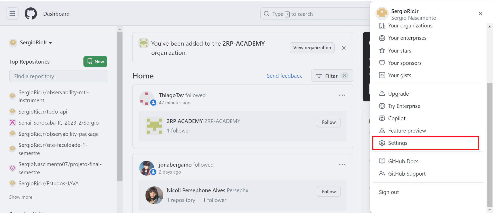
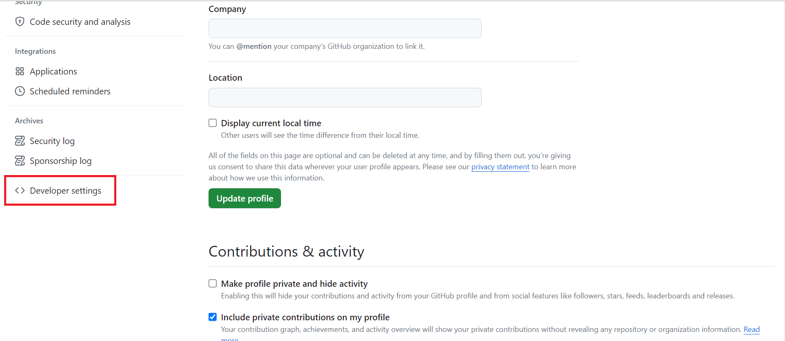
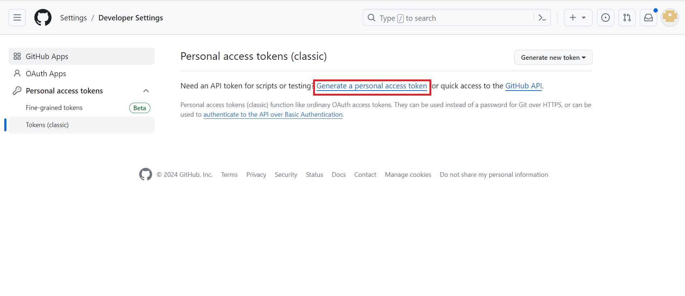
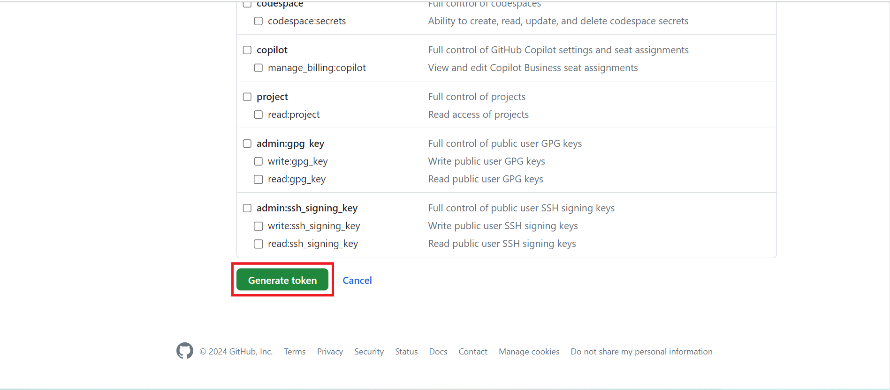
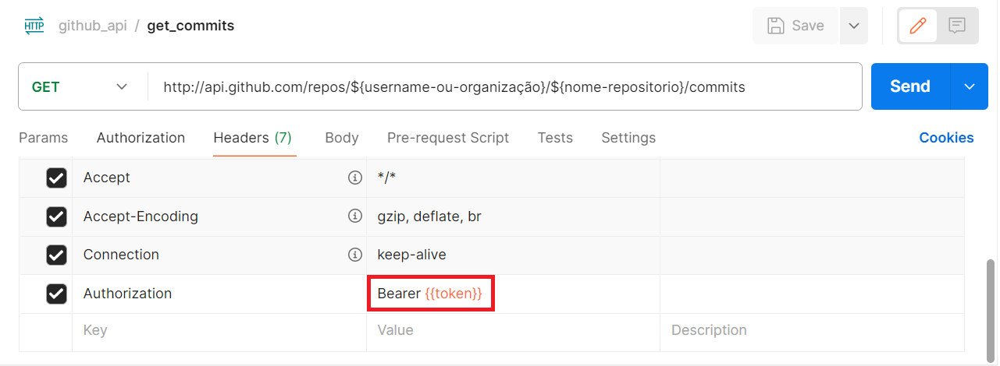

## Documentação API GitHub
Essa documentação traz os principais endpoints, entradas e saídas de dados, e outros detalhes de uso para o futuro desenvolvimento de uma automação.


## Tabela de conteúdos
    
- [Requisitos](requisitos)
- [Autenticação](autenticacao)
- [Principais endpoints](principais-endpoints)

## Requisitos
Nesta pesquisa foi utilizada a linguagem Python, com a biblioteca [requests](https://pypi.org/project/requests/). 
A API do GitHub pode ser acessada também através da [CLI do GitHub](https://cli.github.com/), do CURL, ou com qualquer linguagem de programação capaz de fazer requisições HTTP. Há também ferramentas para facilitar esse acesso em javascript, como o [Octokit](https://www.npmjs.com/package/octokit).  

## Autenticação
Alguns endpoints, como o acesso a repositórios privados através da API requerem autenticação, que pode ser realizada através do token de API fornecido pelo próprio GitHub da seguinte forma:

- 1: Acessar sua conta do GitHub.

- 2: Na barra lateral da direita, acesse a opção "settings".


- 3: Entrar na área de "developer settings":


- 4: Na barra de navegação da esqueda acesse "Tokens (classic)", e clique em "Generate a personal access token"


- 5: Após configurar as permissões, um "note" e a duração, basta apertar o botão "generate token" no final da página:


- 6: Para acessar os endpoints a partir de uma requisição HTTP, seja por Postman ou Curl, é necessário passar o token através dos headers, com a chave "Authorization", e com o padrão "Bearer {Token de acesso}", em Postman é feito da seguinte forma:


para definir a variável basta passar o mouse em cima e clicar em "add new variable"

- 7: Para acessar os endpoints utilizando esse token em Python, siga o seguinte código:

```
    auth = (
        'username',
        'token'
    )

    data = requests.get("enpoint-privado-github", auth=auth)
```

## Principais endpoints


#### Retorna as linguagens utilizadas em um repositório

```http
  GET /api.github.com/repos/${username-ou-organização}/${nome-repositorio}/languages
```
- devolve um objeto com chave para cada linguagem.

#### Retorno informação sobre os commits do projeto

```http
  GET /api.github.com/repos/${username-ou-organização}/${nome-repositorio}/commits
```

principais informações retornadas
| Chave | Tipo    | Descrição                           |
| :---------- | :--------- | :---------------------------------- |
| `commit.author.name` | `string` |  username do autor do commit |
| `commit.author.email` | `string` |  email do autor do commit |
| `commit.author.date` | `datetime` |   data e horário de realização do commit |
| `commit.message` | `string` |  mensagem do commit |
| `stats.total` | `number` |  total de linhas alteradas |
| `stats.additions` | `number` |  linhas adicionadas|
| `stats.deletions` | `number` |  linhas deletadas |
| `files` | `array` |  lista de arquivos alterados e informações da alteração |


#### Retorna dados de usuários específico

```http
  GET /api.github.com/repos/${username-ou-organização}/${nome-repositorio} 
```

principais informações retornadas
| Chave | Tipo    | Descrição                           |
| :---------- | :--------- | :---------------------------------- |
| `login` | `string` |  username da conta |
| `name` | `string` |  nome real do usuário |
| `email` | `string` |  email do usuário|
| `bio` | `string` |  breve resumo sobre o usuário |
| `created_at` | `datetime` |  data e hora da criação da conta |
| `public_repos` | `number` |  número de repositórios públicos do usuário |


#### Retorno informação sobre os pull requests do projeto

```http
  GET /api.github.com/repos/${username-ou-organização}/${nome-repositorio}/pulls
```

principais informações retornadas
| Chave | Tipo    | Descrição                           |
| :---------- | :--------- | :---------------------------------- |
| `state` | `string` |  estado do pull request |
| `title` | `string` |  título do pull request |
| `body` | `string` | mensagem do pull request |
| `head.user.login` | `string` |  username do autor do pull request |
| `head.ref` | `number` | branch de origem do pull request |
| `commits` | `number` | quantidade de commits no pull request  |
| `changed_files` | `number` |  quantidade de arquivos alterados |
| `head.repo.created_at` | `datetime` |  data e horário de criação do pull request |
| `head.repo.updated_at` | `datetime` |  data e horário de alteração do pull request |
| `head.repo.pushed_at` | `datetime` |  data e horário de fechamento do pull request |

#### Retorna informações sobre Issues
```http
  POST /api.github.com/graphql
```

obs: Esse endpoint funciona de forma um pouco diferente, pois utiliza GraphQL. Para facilitar, utilize Postman e na hora de escolher o body, clique na opção GraphQL, e não raw.


No corpo da requisição podem ser pesquisados diversos campos, porém, pode ser enviado da seguinte forma:

```
    query {
    organization(login:"2RP-ACADEMY"){
        projectsV2(first: 20){
            nodes{
                id
                title
                items(first: 20) {
                    nodes {
                        id
                        content {
                            ... on Issue {
                                id
                                title
                                body
                                number
                                state
                                closedAt
                                author{
                                    login
                                }
                                assignees(first: 100){
                                    nodes{
                                        name
                                    }
                                }
                                url
                            }
                        }
                    }
                }
            }
        }
    }
}
```

- para alterar a quantidade de projetos retornados basta mudar o valor depois de "first", ao lado de ProjectV2, pois ele define quantos projetos serão retornados, da mesma maneira que a quantidade de items ou assignees.

Informações retornadas:

principais informações retornadas
| Nome | Tipo    | Descrição                           |
| :---------- | :--------- | :---------------------------------- |
| `id do projeto` | `string` |  - |
| `título do projeto` | `string` |  - |
| `id da issue` | `string` | - |
| `título da issue` | `string` |  - |
| `body/descrição da issue` | `string` | - |
| `número da issue` | `number` | -  |
| `estado da issue` | `string` | "OPEN" ou "CLOSED" |
| `data e hora do fechamento da issue` | `datetime` |  - |
| `criador da issue` | `string` |  login do criador |
| `responsável pela issue` | `string` |  nome do responsável |
| `url da issue` | `string` |  - |


